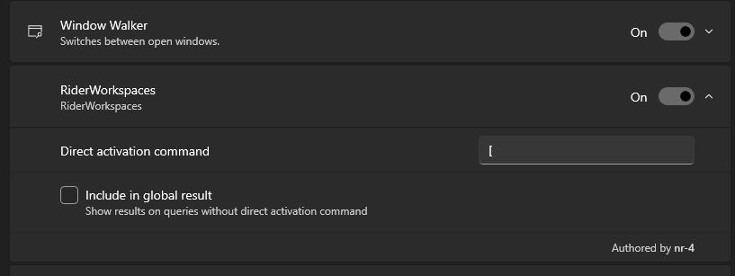

# Jetbrains Rider Workspaces plugin for Powertoys Run  

similar to the VS Code Workspaces plugin included with PowerToys

## Installation

- Add the folder from release to the directory:
- `%LOCALAPPDATA%\Microsoft\PowerToys\PowerToys Run\Plugins\`
- Enable the plugin

## Compiling manually 

this requires ILRepack.exe in your PATH to merge the F# core library into the DLL
as it's not included in PowerToys by default

then the following script builds and adds the published output to the correct directory:

`.\postbuild.ps1`